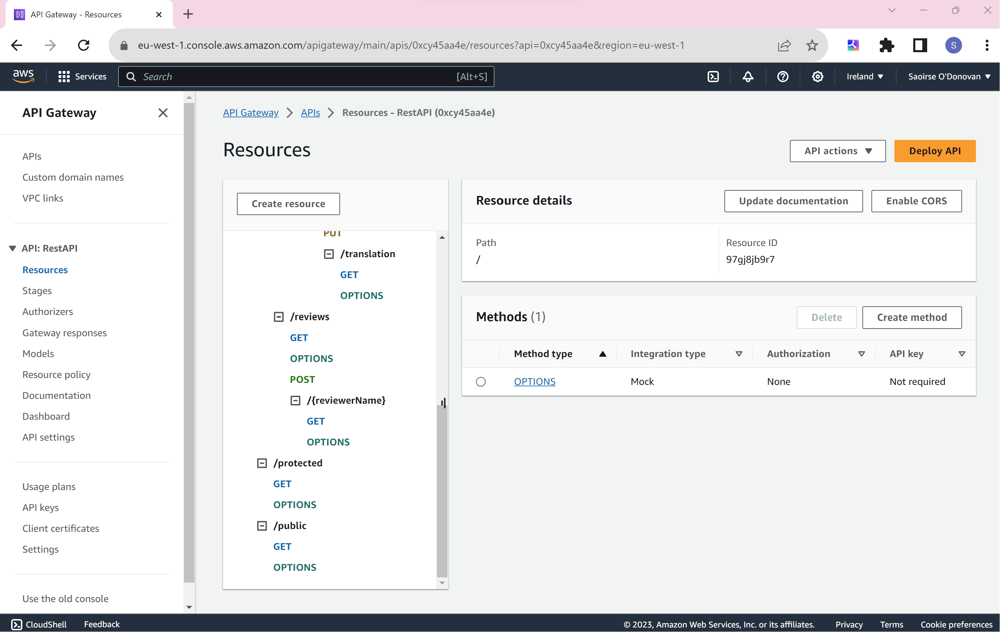

## ServerlessREST Assignment - Distributed Systems.

__Name:__ Saoirse O'Donovan

This repository contains the implementation of a serverless REST API for the AWS platform. A CDK stack creates the infrastructure. The domain context of the API is movie reviews.

### API endpoints.

[Provide a bullet-point list of the app's endpoints (excluding the Auth API endpoints).]
e.g.
 
+ POST /movies/reviews - add a movie review.
+ GET /movies/{movieId}/reviews - Get all the reviews for a movie with the specified id.
+ GET /movies/{movieId}/reviews?minRating=n - Get all the reviews for the movie with the specified ID with a rating greater than the minRating.
+ GET /movies/{movieId}/reviews/{reviewerName} - Get the review for the movie with the specified movie ID and written by the named reviewer.
+ PUT /movies/{movieId}/reviews/{reviewerName} - Update the text of a review. (movie ID and reviewer username uniquely identify a review item).
+ GET /movies/{movieId}/reviews/{year} - Get the review(s) for the movie with the specified movie ID and were written in a specified year.
+ GET /movies/reviews/{reviewerName} - Get all the reviews written by a specific reviewer.
+ GET /movies/{movieId}/reviews/{reviewerName}/translation?language=code - Get a translated version of the review for the movie with the specified movie ID and written by the named reviewer.

[There are some additional endpoints for the Auth API.]

+ POST /auth/signup - Sign up with username, password and email.
+ POST /auth/confirm_signup - Verify sign up with code sent to email.
+ POST /auth/signin - Authenticate with Cookie using token as the value.

[Include screenshots from the AWS console (API Gateway service) that clearly show the deployed API ( have legible font size). ]

[Auth Service API]

[Rest API]

### Authentication..

[Include a screenshot from the AWS console (Cognito User Pools) showing a confirmed user account.]

### To run..
+ Run 'npm install' to begin
+ Next run 'npm run schema'
+ Finally, run 'cdk deploy'
+ When finished, run 'cdk destroy' to clean up everything

### Independent learning (If relevant).

[ Briefly explain any aspects of your submission that required independent research and learning, i.e. not covered in the lectures/labs. State the files that have evidence of this.]

For the implementation of the translate functionality in the lambdas/translate.ts file and some additions in the lib/rest-api-stack.ts files, I used independent learning. The resources used to get the translation of the review involved watching the video highlighted in the assignment specification for a demonstartion on how to use Amazon Translate. I watched that video and also made use of its transcrupt that is structured in a report format. 

State any other evidence of independent learning achieved while completing this assignment.

+ Links for translate: 
https://www.youtube.com/watch?v=xdWpbr1DZHQ&t=1288s
https://completecoding.io/typescript-translation-api/

I also went tthe following link to learn more about regular expressiosn for getting the year that the review was written in. This was implemented in the lambdas/getReviewByReviewerName.ts file.

+ Links for regex:
https://support.abbyy.com/hc/en-us/articles/360017269980-Regular-expressions
